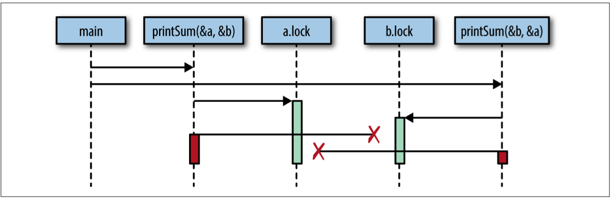

## 并发简介


### Race Conditions 竞态

**出现条件**

> 两个及以上的操作必须按照正确地顺序执行，但程序未对执行顺序进行保证，将会出现 *race condition*

**示例代码**

```go
package main

import "fmt"

func main(){
	var data int
	go func() {
		data ++
	}()
	if data==0{
		fmt.Printf("the value is %v\n",data)
	}
}

```

**结果预测**

> * 没有内容输出，data 在 if 判断之前被改变
> * the value is 0 data 在打印数据之前被该变
> * the value is 1 data在 if 判断之后，打印数据之前被改变 

**竞态检测**

```shell
sun@sundeMacBook-Pro [16:57:47] [~/VSCode/sinksmell/notes/ch01] 
-> % go build -race race1.go 
sun@sundeMacBook-Pro [16:57:58] [~/VSCode/sinksmell/notes/ch01] 
-> % ls           
race1    race1.go
sun@sundeMacBook-Pro [16:58:03] [~/VSCode/sinksmell/notes/ch01] 
-> % ./race1            
the value is 0
==================
WARNING: DATA RACE
Write at 0x00c0000b8008 by goroutine 7:
  main.main.func1()
      /Users/sun/VSCode/sinksmell/notes/ch01/race1.go:8 +0x4e

Previous read at 0x00c0000b8008 by main goroutine:
  main.main()
      /Users/sun/VSCode/sinksmell/notes/ch01/race1.go:10 +0x88

Goroutine 7 (running) created at:
  main.main()
      /Users/sun/VSCode/sinksmell/notes/ch01/race1.go:7 +0x7a
==================
Found 1 data race(s)

// 从上面输出可以看到，data 值在改变前就被 main goroutine 读了
```


**临界资源**

> 可以被被多个进程/线程共享的资源，例如全局变量，共享内存，文件等

**临界区**

> 并不是某个区域，而是访问临界资源的一段代码


**解决竞态，类似操作系统里管理临界区，保证某一时刻，只有一个进程/线程能进入临界区访问临界资源**

> 可对临界资源进行加锁，解决上面例子中的问题

**尝试解除竞态**

> 👇的代码实际上仍然未明确规定哪个goroutine先访问data,只是对临界区加以管理

```go
package main

import (
	"fmt"
	"sync"
)

func main(){
	var data int
	var mutex sync.Mutex
	go func() {
		mutex.Lock()
		defer mutex.Unlock()
		data ++
	}()
	mutex.Lock()
	defer mutex.Unlock()
	if data==0{
		fmt.Printf("the value is %v\n",data)
	}
}

```


**再次检测**

```shell
sun@sundeMacBook-Pro [17:20:11] [~/VSCode/sinksmell/notes/ch01] 
-> % go build -race race1.go
sun@sundeMacBook-Pro [17:21:10] [~/VSCode/sinksmell/notes/ch01] 
-> % ./race1
the value is 0
```


### Atomicity 原子性

**原子性**

> 在某个上下文环境中，一个操作满足不可分割不可打断，就认为这个操作具有原子性
>
> > * 上下文的重要性，可以认为是作用域，例如在进程中的原子操作，放到操作系统层面来看，可能就不是原子操作。

**直觉中的原子操作**

```go
i++
```

> 这条语句看起来是一个原子操作，实际上从指令执行角度它分为3步，虽然每一步都是原子操作，但是组合起来就不是了
>
> * 取出i的值
> * 把i的值加一
> * 存储i的值 

**原子性有何意义?**

> 如果一个操作的原子性得到了保证，那么可以认为这个操作是**并发安全**的


### Memory Access Synchronization

> 实际上就是操作系统中对临界区的管理，可参考线程程之间的同步与互斥


### Deadlocks,Livelocks,and Starvation

#### Deadlock 死锁

> 所有的工作进程/线程都在等待其他的线程释放资源
>
> 死锁必要条件
>
> * 资源独占性
> * 资源不可剥夺
> * 互斥
> * 相互等待

**示例代码**

```go
package main

import (
	"fmt"
	"sync"
	"time"
)

type  value  struct{
    mu sync.Mutex
    value int
}

func main(){
	var wg sync.WaitGroup
	printSum:= func(v1,v2 *value) {
		defer wg.Done()
		v1.mu.Lock()
		defer v1.mu.Unlock()

		time.Sleep(time.Second*2)
		v2.mu.Lock()
		defer v2.mu.Unlock()
		fmt.Printf("sum=%v\n",v1.value+v2.value)
	}

	var a,b value
	wg.Add(2)
	go printSum(&a,&b)
	go printSum(&b,&a)
	wg.Wait()

}

```

**运行结果**

```shell
-> % ./deadlock 
fatal error: all goroutines are asleep - deadlock!

goroutine 1 [semacquire]:
sync.runtime_Semacquire(0xc0000180c8)
        /usr/local/Cellar/go/1.13/libexec/src/runtime/sema.go:56 +0x42
sync.(*WaitGroup).Wait(0xc0000180c0)
        /usr/local/Cellar/go/1.13/libexec/src/sync/waitgroup.go:130 +0x64
main.main()
        /Users/sun/VSCode/sinksmell/notes/ch01/deadlock.go:31 +0x122

goroutine 5 [semacquire]:
sync.runtime_SemacquireMutex(0xc0000180e4, 0x1051300, 0x1)
        /usr/local/Cellar/go/1.13/libexec/src/runtime/sema.go:71 +0x47
sync.(*Mutex).lockSlow(0xc0000180e0)
        /usr/local/Cellar/go/1.13/libexec/src/sync/mutex.go:138 +0xfc
sync.(*Mutex).Lock(...)
        /usr/local/Cellar/go/1.13/libexec/src/sync/mutex.go:81
main.main.func1(0xc0000180d0, 0xc0000180e0)
        /Users/sun/VSCode/sinksmell/notes/ch01/deadlock.go:22 +0x1f4
created by main.main
        /Users/sun/VSCode/sinksmell/notes/ch01/deadlock.go:29 +0xea

goroutine 6 [semacquire]:
sync.runtime_SemacquireMutex(0xc0000180d4, 0x1300, 0x1)
        /usr/local/Cellar/go/1.13/libexec/src/runtime/sema.go:71 +0x47
sync.(*Mutex).lockSlow(0xc0000180d0)
        /usr/local/Cellar/go/1.13/libexec/src/sync/mutex.go:138 +0xfc
sync.(*Mutex).Lock(...)
        /usr/local/Cellar/go/1.13/libexec/src/sync/mutex.go:81
main.main.func1(0xc0000180e0, 0xc0000180d0)
        /Users/sun/VSCode/sinksmell/notes/ch01/deadlock.go:22 +0x1f4
created by main.main
        /Users/sun/VSCode/sinksmell/notes/ch01/deadlock.go:30 +0x114

```


**分析**

> * Main,printSum(&a,&b),printSum(&b,&a) 三个goroutine
> * Main等待两个printSum简记为A，B的返回
> * 现在有两个资源 a,b , A 占用了a, B 占用了b  **独占**
> * A请求资源b, B请求资源a，都不成功，陷入等待状态  **互斥，相互等待**
> * 又有**资源不可剥夺**，于是死锁出现




